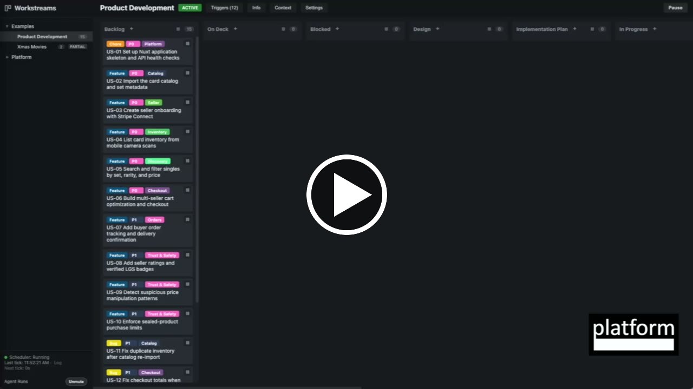

# Orchestra

Orchestra is an agent orchestration framework for coordinating multiple autonomous agents across repeatable workflows. 

It combines a standalone orchestration CLI with a web-based Workstream Manager for creating tasks, assigning agents, following progress, and reviewing a complete audit trail. 

Think of Workstream Manager as a Kanban board that you (human) and agents can both interact with to manage and track work - think "Trello for humans and agents to work together."

Orchestra is model- and task-agnostic. It can coordinate coding, research, operations, marketing, sales, or any other work that can be represented as tasks moving on a Kanban board. State-based and scheduled triggers allow agents to hand work to one another, branch based on results, and repeat steps/loop when review or revision is needed.

Orchestra was built for workflows in which many agents operate concurrently across different kinds of work, not only software development. It supports compound engineering: each run can leave behind structured results, audit history, and accumulated learnings that improve subsequent runs. It also supports metareview workflows in which one agent evaluates another agent's work and sends it back for revision when necessary.

## Watch Orchestra in Action

[](https://www.youtube.com/watch?v=bKJKXCypJoU)

## Quick Start

Requires Python 3.12+ and an authenticated `claude`, `cline`, or `copilot` CLI. `setup.sh` creates and uses an isolated `.venv` automatically.

```bash
git clone https://github.com/Platform-Studio/orchestra.git
cd orchestra
./setup.sh
./run-orchestra.sh
```

The Workstream Manager opens at `http://localhost:8080`. The setup script automatically installs the Xmas Movies example (more detail below).

## Why Orchestra Exists

At Platform Venture Studio, we build multiple startups in parallel. Agents participate across the entire process, from identifying customer problems and conducting market research to product design, implementation, marketing, and sales. We needed one place to define those workflows, coordinate concurrent agents, see what each agent was doing, preserve context across runs, and understand the cost of work at the task level.

We evaluated the available agent frameworks in early 2026, but none matched that combination of general-purpose workflow orchestration, human visibility, hierarchical state, and local ownership of data. Orchestra grew out of that need.

## Features

- Hierarchical workstreams with configurable task states
- State-based and scheduled agent triggers
- Configurable agent concurrency and task locking
- Agent execution through Claude Code, Cline, or GitHub Copilot CLI
- Markdown agent definitions with YAML frontmatter
- Per-workstream context shared across agent runs
- Optional accumulated learnings that improve future runs
- Comments, attachments, errors, progress checklists, and audit history
- Filesystem-based persistence with independently configurable state and artifact roots
- Optional per-task token and cost tracking through [Beans Proxy](https://github.com/platform-studio/beans-proxy)
- A Kanban-style Workstream Manager for humans

## When you **shouldn't** use Orchestra

Orchestra is designed for complex, parallel workflows involving multiple agents and hierarchical state management. 

Each agent's run on each task is expected to be a multi-step process, involving reasoning, decision-making, tool usage, spawning sub-agents, etc. e.g. implementing a product feature, thoroughly researching a topic, sending multiple personalized emails to multiple targets, etc.

Therefore, each time an agent runs on a task, it fires up the full copilot/claude code/cline runtime environment to do the work, and injects a prompt telling it about the current state of the task, the workstream context, and any relevant accumulated learnings. 

This overhead makes Orchestra less suitable for very lightweight or high-frequency tasks where a simple script or direct LLM call would be more efficient.

## How It Fits Together

Orchestra has three parts:

- **Orchestration CLI:** the standalone interface used by humans, scripts, and agents to manage workstreams, tasks, triggers, locks, artifacts, and agent runs.
- **Workstream Manager:** a visual interface on top of the Orchestration CLI. It is effectively a Kanban board for agents: humans can organize work, watch agents run, inspect progress, and review results and audit history.
- **Scheduler:** a background process that continuously evaluates state-based and scheduled triggers and starts eligible agents.

### Orchestration CLI

The CLI allows for managing workstreams, tasks, agents, triggers, locks, artifacts, progress, and the scheduler. It can be used directly by humans, scripts, or agents.

```bash
orc --help
orc workstream list
orc agent list
```

`orchestra` can be used instead of `orc`. You can also call `python -m orchestration` if you want to use a specific Python version.

### Workstream Manager

The Workstream Manager is a web application built on top of the Orchestration CLI. It provides Kanban boards, task details, agent-run status, audit history, attachments, and operational controls.

```bash
orc worksm start
```

### Scheduler

The scheduler evaluates time-based and state-based triggers and starts agents. It runs as a separate foreground process:

```bash
orc scheduler run
```

### run-orchestra.sh

`run-orchestra.sh` is a convenience script that runs both the Workstream Manager and the scheduler in one call. Use `-p` to select a different port, and optionally provide a workspace path:

```bash
./run-orchestra.sh -p 9000
./run-orchestra.sh -p 9000 ./another-workspace
```

When the workspace argument is omitted, the launcher uses `WORKSTREAM_ROOT` if it is configured; otherwise it uses `./xmas-movies-workspace`. An explicit workspace argument always takes precedence.

## Core Concepts

- **Tasks** are the basic units of work. A task has a title, description, state, tags, comments, attachments, errors, progress checklist, and audit trail. In Workstream Manager, tasks appear as cards on a Kanban board.
- **Workstreams** represent workflows. They contain tasks and define a state machine: each state becomes a board column in the Workstream Manager, and the workstream controls which transitions are allowed. Workstreams can contain child workstreams, allowing a large process to be represented as a hierarchy of smaller workflows, and for parent workflows to observe and report on the progress of child workflows.
- **Agents** are autonomous workers defined by Markdown files with YAML frontmatter. When an agent runs, Orchestra provides its instructions together with task details, workstream context, valid transitions, attachments, requested tools, and relevant accumulated learnings.
- **Triggers** cause agents to run. A trigger can respond to a task entering a state, a schedule becoming due, or a supported external event such as inbound email. Trigger actions can start an agent or execute a configured command.
- **Artifacts** are documents, images, and other files consumed or produced during work. Agents access them through Orchestra so artifact storage remains independent of both orchestration state and the code an agent is modifying.
- **Workstream context** is shared operating context supplied to every agent working in that workstream. It acts like a whiteboard that agents and humans can update as understanding evolves.
- **Agent runners** translate an agent definition plus Orchestra's task and workstream context into a process for Claude Code, Cline, GitHub Copilot CLI, or a future runtime. They capture output, enforce timeouts, track lifecycle state, and return results to Orchestra.
- **Locks** prevent agents from accidentally working on the same task concurrently. Orchestra acquires locks during dispatch and releases them when work completes or fails.
- **Audit history** records task changes, comments, state transitions, agent runs, and other important events so humans can reconstruct what happened, when, and why.

### When Agents Run
Agents generally run because:
- a defined trigger is activated
- a schedule becomes due
- a user manually initiates the agent

Triggers are defined at the workstream level. 3 types of triggers are supported:

- state - a task enters a specific state in the workstream
- schedule - at a recurring interval (like a cron job)
- email - when an email is received (uses the Mailgun CLI tool)

Additionally, a task can have a one-time schedule. Once it becomes due and runs, the schedule is cleared.

### Pausing Work
Work can be paused and resumed at multiple levels:
- individual tasks can be paused
- individual states can be paused, meaning no triggers run on tasks in that state
- individual triggers can be paused, meaning the trigger will not activate even if its conditions are met
- whole workstreams can be paused

All of these pause/resume actions can be done with one click through the Workstream Manager interface.

## Repository Layout

```text
/
|-- .github/                # CI workflows and contribution templates
|-- Agents/
|   `-- cli/                # Public agent-facing CLI tools and documentation
|-- audio/                  # Bundled event sounds
|-- docs/                   # Security, release, audit, and image documentation
|-- examples/
|   |-- fruit_and_veg/      # Fruit and Vegetable example definitions and installer
|   |-- install_smoke/      # Deterministic installation smoke test
|   `-- xmas_movies/        # Xmas Movies agents, skill, and installer
|-- orchestration/
|   |-- templates/          # Built-in orchestration templates
|   `-- tests/              # Core framework and CLI tests
|-- scripts/                # Development, release, validation, and audit utilities
|-- workstream_manager/
|   |-- static/             # Browser application
|   `-- tests/              # Server and browser UI tests
|-- .env.example            # Environment configuration template
|-- pyproject.toml          # Python package and dependency metadata
|-- install.sh              # Editable package installer
|-- example.sh              # Example installer dispatcher
|-- setup.sh                # Venv, package, and default example setup
|-- run-orchestra.sh        # Scheduler and Workstream Manager launcher
|-- workstreams/            # Runtime workstream and task state; generated and ignored
|-- artifacts/              # Runtime agent outputs; generated and ignored
`-- *.md / LICENSE          # Project documentation, policies, and governance
```

Generated virtual environments, build output, installed example workspaces, workstream state, and artifacts are ignored by Git and are not tracked repository source.

## Installation From Source

Orchestra supports Python 3.12 on macOS, Windows, and Linux. CI runs the complete test suite plus clean-install, upgrade, and example checks on all three platforms.

The packaged installer described in the project roadmap is not yet available. For the current source checkout:

```bash
python -m venv .venv
source .venv/bin/activate
python -m pip install -e .
```

On Windows PowerShell, activate the environment with `.venv\Scripts\Activate.ps1` instead of `source .venv/bin/activate`. Copy `.env.example` to `.env`, then configure the runtime you intend to use.

Development and optional CLI dependencies are installed as extras:

```bash
python -m pip install -e ".[dev]"
python -m pip install -e ".[image,browser]"
python -m playwright install chromium
```

Configure at least one supported agent runtime:

- Claude Code CLI: install `claude` and authenticate it.
- Cline CLI: install `cline` and authenticate it.
- GitHub Copilot CLI: install `copilot` and complete its normal interactive GitHub sign-in. Token environment variables are only needed for non-interactive or CI use.

Select the default runtime in `.env`:

```dotenv
ORCHESTRATION_AGENT_RUNTIME=copilot
```

Run the scheduler and Workstream Manager together with automatic restart during development:

```bash
python scripts/dev_servers.py
```

Or run them separately:

```bash
orc scheduler run
orc worksm start
```

`orc worksm start` opens the Workstream Manager in your default browser. Use `orc worksm start --no-open` when running without a desktop browser or from a script.

## Upgrading

An Orchestra upgrade replaces the installed Python package while preserving the workspace containing `.env`, workstreams, tasks, artifacts, and audit history. For a tool installation, use the upgrade command provided by the installer:

```bash
pipx upgrade orchestra
# or
uv tool upgrade orchestra
```

For a source installation, pull the newer source and reinstall it into the same virtual environment. Do not delete or replace `WORKSTREAM_ROOT` or `ARTIFACT_ROOT`. Future releases that change persisted YAML formats will include explicit data migrations and release notes.

CI tests this contract by creating workstream, task, and artifact data with a package built from the previous packaged revision, upgrading to the current wheel, and reading the same data through `orc`.

## Examples

Examples are installed through `example.sh`. Run it from the Orchestra repository root after completing `./setup.sh`:

```bash
./example.sh fruit_and_veg
./example.sh xmas_movies
```

The installer copies the example's agent and skill definitions and Orchestra's bundled audio cues into its workspace, then uses the public `orc` CLI to create the workstreams, states, and triggers. It prints the CLI commands as it runs. Reinstalling an example reuses matching resources instead of creating duplicates.

| Example | Install command | Default workspace | What it demonstrates |
|---|---|---|---|
| [Fruit and Vegetable Sorter](examples/fruit_and_veg/README.md) | `./example.sh fruit_and_veg` | `./fruit-and-veg-workspace` | Scheduled generation, state-based classification, comments, tags, and state transitions |
| [Xmas Movies](examples/xmas_movies/README.md) | `./example.sh xmas_movies` | `./xmas-movies-workspace` | Hierarchical workstreams, a branching state machine, a reusable skill, and four collaborating agents |

Both examples use your configured Claude Code, Cline, or GitHub Copilot CLI runtime. The runtime must be authenticated, and running agents will use tokens!

### Agent Definitions

Orchestra uses standard agent definition markdown files (the same as Claude uses). i.e. markdown with some YAML at the top.
Orchestra adds some additional YAML headers (`x-...`) to control runtime behavior and agent capabilities.

```markdown
---
name: Code Reviewer
description: Reviews changes for correctness and risk
x-role: worker
x-runtime: copilot
x-model-level: coding
x-effort: high
x-timeout: 1800
x-learning: true
x-progress-checklist: true
x-own-worktree: true
x-tools:
  - browser
---

Review the assigned task and its implementation.
```

Supported headers include:

| Header | Purpose |
|---|---|
| `name` | Human-readable agent name |
| `description` | Short description used in listings |
| `x-role` | `worker`, `manager`, `director`, or `executive`; `exec` is accepted as an alias |
| `x-runtime` | `claude-code`, `cline`, or `copilot`; `claude` aliases `claude-code` |
| `x-model` | Exact model identifier; overrides `x-model-level` |
| `x-model-level` | Logical `high`, `medium`, `low`, or `coding` model tier |
| `x-effort` | Runtime effort hint: `low`, `medium`, `high`, `xhigh`, or `max` |
| `x-timeout` | Maximum run time in seconds |
| `x-learning` | Enables or disables accumulated agent learnings |
| `x-progress-checklist` | Enables a visible run checklist |
| `x-own-worktree` | Gives the run an isolated Git worktree |
| `x-tools` | Names of documented CLI tools requested by the agent |
| `x-sound-start`, `x-sound-finish`, `x-sound-error` | Optional event sound names |

The x-... headers override defaults set in the environment (e.g. in your `.env` file) so they are optional and only need to be specified when you want a specific agent to override the default behavior.

### How Orchestra Finds Agent Definitions

Agent references can use a filename, a relative path, or the human-readable frontmatter name. Definitions are resolved in this precedence order:

1. The normal project or built-in `Agents/` directory
2. Directories in `ORCHESTRA_AGENT_PATHS`, in configured order

Later configured directories take precedence over earlier directories. Multiple paths use the platform path separator: `:` on macOS and Linux, and `;` on Windows.

```dotenv
ORCHESTRA_AGENT_PATHS=/path/to/team-agents:/path/to/private-agents
```

`ORCHESTRATION_AGENTS_DIR` remains available as a legacy single-directory override.
The former `ORKESTRA_AGENT_PATHS` spelling is also accepted as a compatibility alias when `ORCHESTRA_AGENT_PATHS` is unset.

#### Agent Roles

| Role | Responsibility |
|---|---|
| `worker` | Completes individual tasks and can usually run in parallel with other workers. |
| `manager` | Creates and coordinates task lists for workers. |
| `director` | Plans and monitors a functional area against a broader objective. |
| `executive` | Owns overall objectives, coordinates directors, and interfaces with humans. |


### Skills

Skills are Markdown resources that give agents reusable procedures, constraints, or domain knowledge. Project skills conventionally live under `Agents/skills/`.

External skill directories can be supplied through `ORCHESTRA_SKILL_PATHS`:

```dotenv
ORCHESTRA_SKILL_PATHS=/path/to/shared-skills:/path/to/private-skills
```

When this variable is set, Orchestra includes those locations in the agent's initialization instructions. Skill selection and loading are performed by the agent runtime; Orchestra does not currently parse skills into an internal registry.
The former `ORCHESTRA_SKILL_PATHS` spelling remains a compatibility alias.

### Agent-Facing CLI Tools

A discoverable CLI tool in `Agents/cli/` consists of a Python implementation and matching Markdown documentation with the same base name:

```text
Agents/cli/browser.py
Agents/cli/browser.md
```

An agent requests tools with `x-tools`. For matching project-local pairs, Orchestra adds the command path and Markdown documentation to the agent's system prompt.

External CLI directories can be supplied through `ORCHESTRA_CLI_PATHS`:

```dotenv
ORCHESTRA_CLI_PATHS=/path/to/shared-cli:/path/to/private-cli
```

Orchestra currently tells the initialized agent where these external tools are located. Automatic discovery and prompt injection of external tool pairs is not yet implemented.

### Persistence

The current persistence implementation stores workstreams, tasks, locks, scheduler state, audits, run metadata, and artifacts on the filesystem.

Two process-level settings route data independently:

```dotenv
WORKSTREAM_ROOT=file:/absolute/path/to/state
ARTIFACT_ROOT=file:/absolute/path/to/artifacts
```

- `WORKSTREAM_ROOT` controls workstream YAML, task YAML, locks, scheduler state, audits, and agent-run state.
- `ARTIFACT_ROOT` controls artifact storage.
- Both accept absolute paths or local `file:` URIs.
- Other URI schemes are currently rejected.

Within a workstream root, state uses this layout:

```text
workstreams/<workstream-id>.yaml
workstreams/<workstream-id>/tasks/<task-id>.yaml
workstreams/<workstream-id>/workstreams/<child-workstream-id>.yaml
```

By default, each workstream's children are stored beneath its home directory as shown above. `child_workstream_root` can redirect direct children to another workstream root. `working_directory` and `artifact_root` are inherited by descendants unless a descendant overrides them.

Artifact paths are logical paths beneath `<artifact-root>/artifacts/`. A leading slash is ignored, and paths cannot traverse outside that directory.

A workstream can also define:

- `working_directory` for the code or project an agent should modify
- `child_workstream_root` for descendant workstream state
- `artifact_root` for artifacts in that workstream subtree

Keep orchestration state and artifacts outside repositories where agents create branches or worktrees. Otherwise, changing branches can produce conflicting or apparently missing task state.

Database, GitHub, and other persistence backends are planned extension points, but there is not yet a public persistence-adapter interface. That interface should preserve the existing task, workstream, locking, audit, and artifact behavior.

### Agent Runners

The runner contract turns an agent definition plus task/workstream context into an isolated runtime process. Current runners support Claude Code, Cline, and GitHub Copilot CLI.

Runtime selection precedence is:

1. Agent `x-runtime`
2. `ORCHESTRATION_AGENT_RUNTIME`
3. `claude-code`

Model selection precedence is:

1. Agent `x-model`
2. Agent `x-model-level` mapped through runtime-specific environment settings
3. Runtime default

Effort selection precedence is:

1. Agent `x-effort`
2. Level-specific effort environment setting
3. Runtime default effort setting
4. No explicit effort

Before starting a runtime, Orchestra provides:

- Agent instructions and requested tool documentation
- Task and workstream identifiers and context
- Valid task-state transitions
- Attachment locations and, when configured, inline attachment content
- Orchestration and product workspace roots
- An execution contract for reading tasks, posting results, and updating state

During and after execution, the runner records run metadata, streams output to a log, updates the audit trail, captures supported runtime context, tracks progress, releases locks, and classifies the result as completed, failed, killed, or timed out.

A future runner adapter should preserve this lifecycle while translating it to another model or agent harness.

## Environment Hierarchy

A root `.env` provides process defaults. Each workstream can also have a `.env` file beside its task directory, and a workstream's configured working directory can contribute its own `.env` file. Layers are applied from the root ancestor to the selected workstream; descendant values override ancestor values. Setting `KEY=` masks that key, including any process-environment fallback.

`ORCHESTRATION_BASE_ENV_PATH` can select an explicit lowest-precedence base environment file. Otherwise Orchestra uses the repository `.env` when present, followed by the process environment for keys not defined by any file layer.

This makes it possible to share common runtime settings while keeping project-specific credentials and configuration at the appropriate workstream level. Never commit populated `.env` files.

For agents with learning enabled, Orchestra checks the agent's learnings file after each run. If it exceeds `ORCHESTRATION_LEARNINGS_COMPACTION_THRESHOLD_BYTES`, Orchestra archives the original and replaces it with a deduplicated summary containing up to the 80 most recent entries. The default threshold is 20,000 bytes; invalid or non-positive values use the default.

## Runtime Paths

Orchestra keeps four locations independent:

| Location | Purpose |
|---|---|
| Orchestra root | Framework code, public definitions, and CLI tools |
| Workstream root | Workstreams, tasks, locks, scheduler state, and audits |
| Artifact root | Files read or produced by agents |
| Working directory | Project code an agent reads or modifies |

Agent prompts and subprocesses receive `ORCHESTRATION_ROOT` for the Orchestra repository and `WORKSPACE_ROOT` for the effective working directory. They also receive agent, run, task, and workstream identifiers. Dedicated environment variables for the resolved workstream, artifact, and child-workstream roots are not currently injected; agents should use the orchestration CLI so those paths are resolved consistently.

## Agent Concurrency
By default, only one instance of a given agent can run concurrently on each workstream.

Concurrency is controlled at the workstream level by defining a concurrency policy.

```json
{
  "default": 2,
  "state_overrides": {
    "Staging Deploy": {
      "overrides": {
        "devops": 1
      }
    },
    "Production Deploy": {
      "overrides": {
        "devops": 1
      }
    }
  }
}
```

## Token and Cost Tracking

Orchestra can optionally route supported agent calls through [Beans Proxy](https://github.com/platform-studio/beans-proxy) to record token usage by task. When enabled, task totals are stored with run metadata and displayed by the Workstream Manager.

```dotenv
BEANS_PROXY=true
BEANS_PROXY_HOST=127.0.0.1
BEANS_PROXY_PORT=8000
```

Follow the installation instructions for [Beans Proxy](https://github.com/platform-studio/beans-proxy) and run it. Orchestra will then route supported agent calls through the proxy to track token usage.

## Development

Run the complete test suite with:

```bash
python -m pytest -q
```

Tests use `./.test/pytest` and clear external persistence-root settings so test workspaces cannot write into live orchestration data.

During development, run the scheduler and server with automatic restart:

```bash
.venv/bin/python scripts/dev_servers.py
```

Logs are written under `ARTIFACT_ROOT/artifacts/logs/`, or `./artifacts/logs/` when `ARTIFACT_ROOT` is unset.

## Project Policies

- [Contributing](CONTRIBUTING.md)
- [Support](SUPPORT.md)
- [Security policy](SECURITY.md) and [security model](docs/security-model.md)
- [Governance and open-core commitment](GOVERNANCE.md)
- [Code of conduct](CODE_OF_CONDUCT.md)
- [Changelog](CHANGELOG.md) and [release process](docs/releasing.md)
- [Apache License 2.0](LICENSE)

## Project Status

The existing public Orchestra repository is being expanded with this orchestration framework and Workstream Manager. A packaged installer, additional examples, and formal adapter APIs are still being completed.
